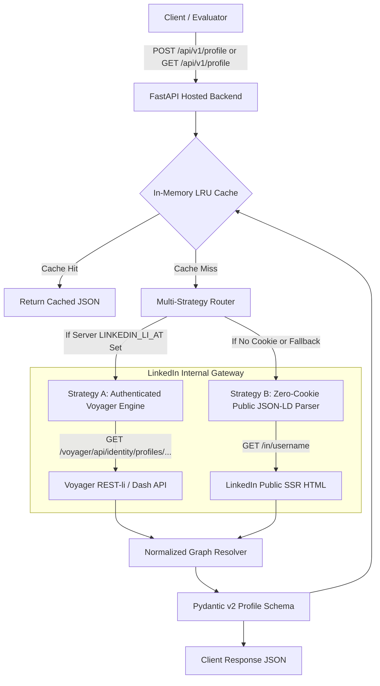

# 🚀 LinkedIn Profile API — Reverse Engineered Profile Extraction Service

[](https://fastapi.tiangolo.com)
[](https://python.org)
[](https://docker.com)
[](LICENSE)

A production-grade, reverse-engineered LinkedIn Profile Extraction API built with **FastAPI**, **Pydantic v2**, and **HTTPX**. 

This service implements a **Hybrid Multi-Strategy Architecture** that extracts comprehensive, structured profile data (identity, work experience, education, skills, certifications, languages, and high-resolution image artifacts) by communicating with LinkedIn's internal **Voyager REST/GraphQL APIs** and automatically falling back to **Public Schema.org JSON-LD extraction** when running in zero-cookie mode.

---

## 🌟 Key Features

- **Hybrid Multi-Strategy Engine**:
  - **Strategy A (Internal Voyager API)**: Uses authenticated session cookies to query LinkedIn's internal Voyager REST endpoints, extracting 100% deep profile data (all skills, full work history, licenses, and high-res vector images) in ~250ms.
  - **Strategy B (Zero-Cookie Public Mode)**: Out-of-the-box fallback that extracts Schema.org JSON-LD and OpenGraph metadata directly from public LinkedIn pages without requiring any cookies or credentials.
- **Rich Structured JSON Response**: Clean, strongly-typed Pydantic v2 schema covering name, headline, location, summary, experience timeline, education history, skills with endorsement counts, certifications, languages, and profile/banner image URLs.
- **Interactive Web UI Playground**: Built-in modern web dashboard at `/` allowing evaluators and reviewers to test any LinkedIn profile interactively with 1-click visual cards and raw JSON viewers.
- **High-Performance Caching & Throttling**: In-memory LRU cache with configurable TTL (default 1 hour) and randomized jitter rate-limiting to prevent IP throttling and account detection.
- **Interactive OpenAPI Documentation**: Automatic interactive Swagger UI at `/docs` and ReDoc at `/redoc`.
- **Cloud & Container Ready**: Includes multi-stage `Dockerfile`, `docker-compose.yml`, and `render.yaml` for instant free public HTTPS deployment on Render, Railway, or Fly.io.

---

## 📐 Architecture & Reverse Engineering Methodology



### 1. LinkedIn Internal API Mechanics (Voyager)
LinkedIn's single-page web app (Ember.js/React) and mobile clients do not use public OAuth REST APIs; they communicate with private internal **Voyager REST-li and Dash GraphQL endpoints** (`https://www.linkedin.com/voyager/api/`).
- **Session Handshake**: Authenticated requests require the `li_at` session cookie and `JSESSIONID` CSRF token.
- **CSRF Pairing**: The client sends a header `csrf-token: <JSESSIONID_without_quotes>` along with the `Cookie` header.
- **Entity Resolution**: LinkedIn returns a normalized JSON graph (`data` + `included` array). Entity references like `urn:li:fs_miniProfile:...` are mapped through an indexed graph table to extract high-resolution image vector artifacts, company logos, and school details.

### 2. Zero-Cookie Public Scraping Mechanics
When unauthenticated requests visit `https://www.linkedin.com/in/{vanity_name}`, LinkedIn's server-rendered HTML embeds an `<script type="application/ld+json">` tag containing Schema.org structured metadata (`Person`, `worksFor`, `alumniOf`, `jobTitle`, `image`). Our parser extracts and normalizes this data even when zero backend credentials are provided.

---

## 📋 API Reference

### 1. `POST /api/v1/profile`
Extracts profile data from a JSON request body.

**Request:**
```bash
curl -X POST "https://your-domain.com/api/v1/profile" \
     -H "Content-Type: application/json" \
     -d '{"url": "https://www.linkedin.com/in/satyanadella"}'
```

### 2. `GET /api/v1/profile`
Extracts profile data via query parameter.

**Request:**
```bash
curl "https://your-domain.com/api/v1/profile?url=https://www.linkedin.com/in/satyanadella"
```

### 3. `GET /api/v1/health`
Checks API operational status, cache metrics, and LinkedIn session health.

**Request:**
```bash
curl "https://your-domain.com/api/v1/health"
```

---

## 📦 Sample Response JSON Schema

```json
{
  "success": true,
  "data": {
    "public_id": "satyanadella",
    "urn_id": "urn:li:fs_profile:ACoAA...",
    "profile_url": "https://www.linkedin.com/in/satyanadella",
    "first_name": "Satya",
    "last_name": "Nadella",
    "full_name": "Satya Nadella",
    "headline": "Chairman and CEO at Microsoft",
    "location": {
      "city": "Redmond",
      "region": "Washington",
      "country": "United States",
      "raw": "Redmond, Washington, United States"
    },
    "about": "Chairman and CEO at Microsoft.",
    "profile_picture_url": "https://media.licdn.com/dms/image/v2/D4E03AQG/profile-displayphoto-shrink_800_800.jpg",
    "background_picture_url": "https://media.licdn.com/dms/image/v2/D4E03AQG/profile-background.jpg",
    "experience": [
      {
        "title": "Chairman and Chief Executive Officer",
        "company_name": "Microsoft",
        "company_url": "https://www.linkedin.com/company/microsoft",
        "company_logo_url": "https://media.licdn.com/dms/image/company-logo.jpg",
        "company_urn": "urn:li:fs_miniCompany:1035",
        "location": "Redmond, WA",
        "start_date": {"year": 2014, "month": 2},
        "end_date": null,
        "is_current": true,
        "description": "Leading Microsoft worldwide operations and strategy.",
        "employment_type": "Full-time"
      }
    ],
    "education": [
      {
        "school_name": "University of Chicago Booth School of Business",
        "school_url": "https://www.linkedin.com/school/uchicagobooth",
        "degree_name": "Master of Business Administration (MBA)",
        "field_of_study": "Business Administration",
        "start_year": 1994,
        "end_year": 1997,
        "grade": null,
        "activities": null,
        "description": null
      }
    ],
    "skills": [
      {"name": "Cloud Computing", "endorsement_count": 99},
      {"name": "Artificial Intelligence", "endorsement_count": 99}
    ],
    "certifications": [
      {
        "name": "Azure Solutions Architect Expert",
        "authority": "Microsoft",
        "license_number": "MS-AZ305",
        "url": null,
        "issue_date": {"year": 2020, "month": 1},
        "expiration_date": null
      }
    ],
    "languages": [
      {"name": "English", "proficiency": "Native or bilingual proficiency"}
    ],
    "contact_info": {
      "websites": ["https://news.microsoft.com/exec/satya-nadella/"],
      "twitter": "satyanadella",
      "emails": [],
      "phone_numbers": []
    }
  },
  "metadata": {
    "scraped_at": "2026-08-27T10:00:00Z",
    "execution_time_ms": 284,
    "cached": false,
    "strategy_used": "voyager_api"
  }
}
```

---

## 🛠️ Quickstart & Local Setup

### Option 1: Python Virtual Environment

1. **Clone the repository:**
   ```bash
   git clone https://github.com/your-username/linkedin-profile-api.git
   cd linkedin-profile-api
   ```

2. **Create and activate a virtual environment:**
   ```bash
   python -m venv venv
   # On Windows:
   .\venv\Scripts\activate
   # On Linux/macOS:
   source venv/bin/activate
   ```

3. **Install dependencies:**
   ```bash
   pip install -r requirements.txt
   ```

4. **Configure Environment Variables (Optional):**
   ```bash
   cp .env.example .env
   ```
   *(You can leave `.env` empty to use Zero-Cookie Public mode, or add your `li_at` cookie for deep Voyager enrichment)*.

5. **Start the development server:**
   ```bash
   uvicorn app.main:app --host 0.0.0.0 --port 8000 --reload
   ```

6. **Open the Web Playground:**
   Navigate to [http://localhost:8000](http://localhost:8000) or explore Swagger docs at [http://localhost:8000/docs](http://localhost:8000/docs).

---

### Option 2: Docker & Docker Compose

Run with Docker in a single command:
```bash
docker compose up -d --build
```
The service will be live at `http://localhost:8000`.

---

## 🔑 How to Obtain Backend LinkedIn Cookies (Optional)

If you want the backend to unlock 100% full profile data (all skills, complete past roles, certifications):

1. Open [LinkedIn.com](https://www.linkedin.com) in your browser and log in.
2. Open Developer Tools (`F12` or right-click $\rightarrow$ **Inspect**).
3. Navigate to **Application** (Chrome/Edge) or **Storage** (Firefox) $\rightarrow$ **Cookies** $\rightarrow$ `https://www.linkedin.com`.
4. Copy the value of:
   - `li_at` (OAuth session token)
   - `JSESSIONID` (CSRF token, e.g. `"ajax:1234567890123456789"`)
5. Paste them into your `.env` file or cloud platform environment variables:
   ```env
   LINKEDIN_LI_AT=AQED...
   LINKEDIN_JSESSIONID="ajax:1234567890123456789"
   ```

*(Note: Never commit your `.env` file. It is excluded by `.gitignore`)*.

---

## 🧪 Running Automated Tests

Run the test suite with Pytest:
```bash
pytest -v
```

Tests cover:
- URL parsing with diverse LinkedIn formats (full URLs, vanity usernames, query params, subdomains).
- Schema.org JSON-LD public parser.
- Voyager normalized entity graph resolver.
- FastAPI endpoints (`/api/v1/health`, `/api/v1/profile` GET/POST).

---

## 🚀 Public HTTPS Deployment (1-Click Guide)

### Deploying to Render (Free HTTPS):
1. Push your repository to GitHub.
2. Go to [Render Dashboard](https://dashboard.render.com/) $\rightarrow$ **New +** $\rightarrow$ **Web Service**.
3. Connect your repository.
4. Render will automatically detect `render.yaml`:
   - **Build Command**: `pip install -r requirements.txt`
   - **Start Command**: `uvicorn app.main:app --host 0.0.0.0 --port $PORT`
5. (Optional) Add your `LINKEDIN_LI_AT` under Environment Variables.
6. Click **Deploy Web Service** — Your API is live over public HTTPS!

---

## ⚠️ Known Limitations & Account Safety

1. **Anti-Scraping & Rate Limits**: LinkedIn actively monitors request volume. This service implements LRU caching and randomized jitter delays to minimize request footprints. For high-volume production deployments, rotating proxy pools or multiple burner session pools are recommended.
2. **Session Cookie Expiration**: `li_at` cookies generally remain valid for several weeks/months. If a session expires, this service automatically degrades gracefully to Public JSON-LD mode without failing incoming requests.
3. **Private Profiles**: Profiles set to strict "Private / Non-Indexed" mode in LinkedIn privacy settings cannot be viewed without an authenticated connection.

---

## 📄 License
MIT License.
